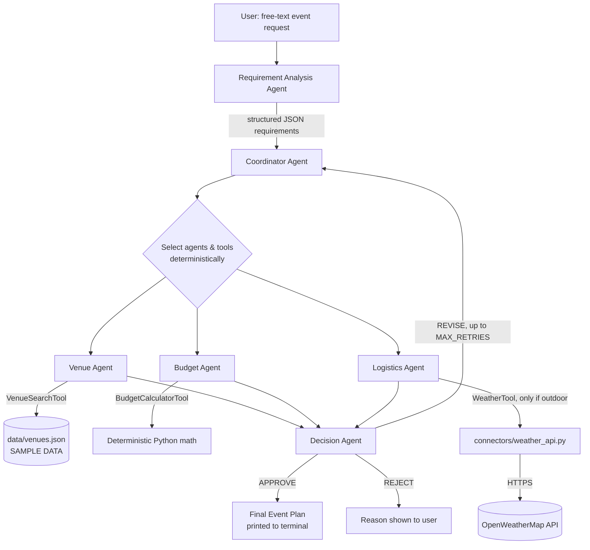

# EventFlow AI — Multi-Agent Event Planning & Decision Engine

## Project Domain
AI Agent Coordination & Decision Engine

## Problem Statement
Planning an event (venue, budget, logistics, weather) involves juggling
several interdependent constraints at once. A single monolithic AI
prompt struggles to reason reliably about all of them together, and
LLMs are unreliable at precise arithmetic and live data lookups.

## Project Objective
Build a **multi-agent system** where specialized AI agents each own one
concern (requirements, budget, venue, logistics, decision-making),
coordinate through a central Coordinator Agent, use deterministic tools
for anything requiring exact calculation or filtering, and converge on
an APPROVE / REVISE / REJECT decision for a complete event plan — all
driven from a terminal interface.

---

## Milestone 1 — Agent Foundation Development (Weeks 1–2)

**Requirements:** configure LangChain + Gemini, build foundational
agents, implement prompt templates and interaction workflows, provide a
basic CLI testing interface.

**Implementation:**
- `agents/requirement_agent.py` — extracts structured JSON requirements from free text.
- `agents/coordinator_agent.py` — deterministic agent/tool selection + orchestration.
- `agents/budget_agent.py`, `agents/venue_agent.py`, `agents/logistics_agent.py` — specialized agents.
- `agents/decision_agent.py` — evaluates combined outputs into APPROVE / REVISE / REJECT.
- `prompts/agent_prompts.py` — one dedicated `PromptTemplate` per LLM-powered agent.
- `main.py` — terminal interface showing each agent's execution live.

## Milestone 2 — Tool Integration & Action Execution (Weeks 3–4)

**Requirements:** custom tools/connectors, intelligent tool selection,
tool invocation + exception handling, action validation.

**Implementation:**
- `tools/budget_tool.py` — deterministic Budget Calculator Tool (Pydantic-validated).
- `tools/venue_tool.py` + `data/venues.json` — deterministic Venue Search Tool over **sample data**.
- `tools/weather_tool.py` + `connectors/weather_api.py` — Weather Tool over a real API connector (OpenWeatherMap), only invoked for outdoor events.
- `utils/validators.py` — deterministic validation used by the Decision Agent.
- `utils/logger.py` — consistent, secret-safe logging across the whole app.

---

## Architecture



### Agents

| Agent | Role |
|---|---|
| Requirement Analysis Agent | Free text → structured JSON requirements |
| Coordinator Agent | Chooses agents/tools, runs the cycle, re-runs only affected agents on REVISE |
| Budget Agent | Proposes category allocation %; hands math to BudgetCalculatorTool |
| Venue Agent | Filters venues via VenueSearchTool, picks the best candidate |
| Logistics Agent | Builds schedule/recommendations, optionally calls WeatherTool |
| Decision Agent | Deterministically checks constraints, returns APPROVE/REVISE/REJECT |

### Tools

| Tool | Purpose | Deterministic? |
|---|---|---|
| BudgetCalculatorTool | Total cost, remaining budget, category allocation | Yes (Python + Pydantic validation) |
| VenueSearchTool | Filters `data/venues.json` (SAMPLE DATA) by location/capacity/price/type | Yes |
| WeatherTool | Live weather via OpenWeatherMap, only for outdoor events | External API, deterministic error handling |

### Intelligent Tool Selection
The Coordinator decides tool usage in Python (`select_agents_and_tools`),
**not** via the LLM — e.g. `WeatherTool` is only added to the plan when
`venue_type == "outdoor"`. The terminal prints which tools were selected
and which were skipped, with reasons.

### Gemini + LangChain Usage
Each LLM-powered agent builds its own `PromptTemplate | ChatGoogleGenerativeAI`
chain (`prompts/agent_prompts.py` + `agents/__init__.py::get_llm`). The
LLM is used strictly for language tasks it's good at (extraction,
summarizing, phrasing) — never for arithmetic or live data, which are
always delegated to deterministic tools.

### Weather API Integration
`connectors/weather_api.py` calls OpenWeatherMap's current-weather
endpoint with a timeout, and returns a structured `{"status": "unavailable", ...}`
result (never fabricated data) on any missing key, timeout, network
error, bad HTTP status, or malformed JSON.

### Exception Handling
Covered: missing Gemini/Weather API keys, API timeouts, network
failures, malformed Gemini JSON, invalid tool arguments (negative
budget, zero/negative attendees), no matching venue, budget exceeded,
and a maximum retry cap on the REVISE loop (`MAX_RETRIES` in
`agents/coordinator_agent.py`).

---

## Project Structure

```
EventFlow-AI/
├── agents/
│   ├── __init__.py            # shared Gemini client + JSON parsing helper
│   ├── requirement_agent.py
│   ├── coordinator_agent.py
│   ├── budget_agent.py
│   ├── venue_agent.py
│   ├── logistics_agent.py
│   └── decision_agent.py
├── tools/
│   ├── budget_tool.py
│   ├── venue_tool.py
│   └── weather_tool.py
├── connectors/
│   └── weather_api.py
├── prompts/
│   └── agent_prompts.py
├── data/
│   └── venues.json             # SAMPLE venue data
├── utils/
│   ├── logger.py
│   └── validators.py
├── tests/
│   ├── test_budget_tool.py
│   ├── test_venue_tool.py
│   └── test_workflow.py
├── main.py
├── requirements.txt
├── .env.example
├── .gitignore
└── README.md
```

---

## Installation

```bash
cd EventFlow-AI
python3 -m venv venv
source venv/bin/activate        # Windows: venv\Scripts\activate
pip install -r requirements.txt
```

## Environment Setup

```bash
cp .env.example .env
```

Then edit `.env`:
- `GEMINI_API_KEY` — from https://aistudio.google.com/app/apikey
- `WEATHER_API_KEY` — from https://openweathermap.org/api (free tier)

`.env` is git-ignored and never committed. Never hard-code keys in code.

## How to Run

```bash
python main.py
```

### Sample Terminal Input
```
Describe your event:

> Plan an outdoor college technical event in Chennai for 200 attendees
  under ₹70,000 with vegetarian food.
```

### Sample Terminal Output (abridged)
```
[Requirement Agent]
✓ Requirements extracted

[Coordinator Agent]
Analyzing required tasks...
Required tools identified:
  ✓ BudgetCalculatorTool
  ✓ VenueSearchTool
  ✓ WeatherTool

[Venue Agent]
Invoking VenueSearchTool...
✓ Suitable venues found (selected: Greenfield Lawns)

[Budget Agent]
Invoking BudgetCalculatorTool...
✓ Budget calculated

[Logistics Agent]
Invoking WeatherTool...
✓ Weather information retrieved

[Decision Agent]
Checking constraints...
Budget................PASS
Venue Capacity........PASS
Venue Preference......PASS
Weather...............PASS
Decision: APPROVE

=============================================
          FINAL EVENT PLAN
=============================================
Event:              College Technical Event
Location:           Chennai
Attendees:          200
Selected Venue:     Greenfield Lawns (capacity 300, ₹12000)
Estimated Budget:   ₹65200
Remaining Budget:   ₹4800
Weather:             Clear, 29°C
Schedule:
  - 9:00 AM - Registration & Check-in
  ...
=============================================
```

## Testing

```bash
pytest tests/ -v
```

Covers: budget correctness + negative-value rejection, venue filtering
(capacity/location/no-match), weather API failure handling, intelligent
weather-tool selection (outdoor vs indoor), Decision Agent violation
detection (budget/capacity), APPROVE/REVISE workflows, and the
maximum-retry safeguard.

---

## Notes
- `data/venues.json` is explicitly **SAMPLE DATA** — not a live venue inventory.
- The LLM never performs arithmetic; `BudgetCalculatorTool` always does.
- The LLM never invents a venue outside the deterministically filtered candidate list.
- Only Milestones 1 & 2 are implemented — no FastAPI, Streamlit, database, or auth, by design.
